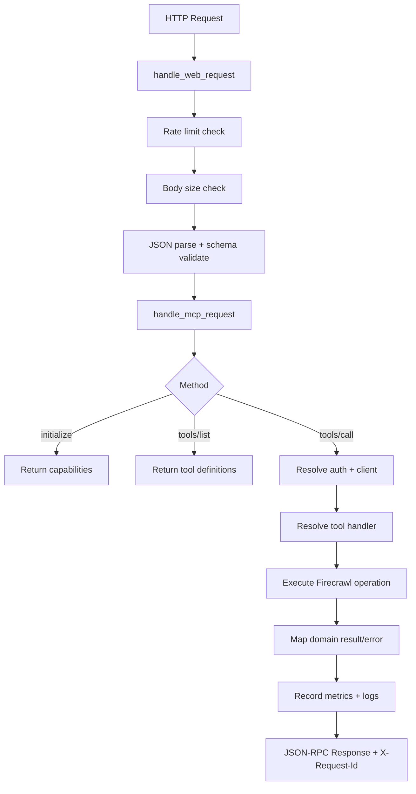
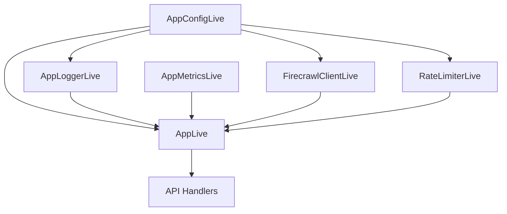
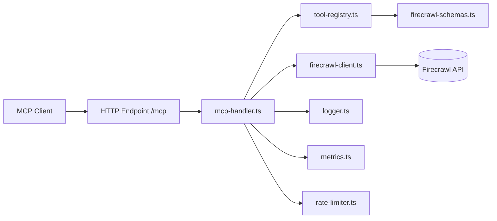

# Architecture and Dependencies

This document maps request flow, service composition, and key dependencies.

## Request lifecycle

## Layered dependency graph

## Runtime component map

## Key files

- `src/api/groups/mcp-handler.ts`: request parsing, auth extraction, dispatch, response shaping
- `src/tools/tool-registry.ts`: tool routing + schema decode + operation execution
- `src/services/firecrawl-client.ts`: Firecrawl SDK adapter and error wrapping
- `src/config/app-config.ts`: typed env loading and defaults
- `src/services/metrics.ts`: in-memory metric aggregation and Prometheus export
- `src/services/rate-limiter.ts`: dependency-inverted request rate limiting

## Security and reliability controls

- input schema validation for MCP envelopes and tool params
- bounded request size and timeout budget
- request-level rate limiting with retry headers
- structured logging and request correlation via `X-Request-Id`
- Prometheus-compatible metrics endpoint
